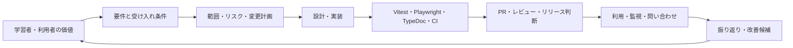

# PMBOK / ITIL を加味した実践ガイド

この資料は、PMBOK と ITIL の考え方を、この小さな Next.js / Nuxt 学習プロジェクトへ過不足なく対応付けるためのものです。プロジェクトの規模に合わせて手法を tailored し、認定、公式な適合性、または特定の版への完全準拠を主張しません。

PMBOK は価値提供、原則、パフォーマンスドメインを通してプロジェクトの成果を捉えます。ITIL はサービス価値、ガバナンス、継続的改善、組織・人、情報・技術、パートナー・サプライヤ、価値流れ・プロセスといった観点でサービスを捉えます。公式情報は [PMI の PMBOK Guide](https://www.pmi.org/standards/pmbok) と [PeopleCert の ITIL Foundation](https://www.peoplecert.org/browse-certifications/it-governance-and-service-management/ITIL-1/itil-4-foundation-2565) を参照してください。

## このプロジェクトへの対応付け

| 観点 | AI エージェントが行うこと | このリポジトリの証跡 |
| --- | --- | --- |
| 価値・関係者 | 学習者が「同じ機能の差」を理解できる価値を最初に確認する | README の目的、比較ガイド、受け入れ条件 |
| 範囲・要求 | 要件 ID、非機能要件、除外範囲を合意し、機能を両アプリに対応付ける | `docs/project-lifecycle-guide.md`、blueprint |
| 品質 | 型、unit/E2E、API 資料、build を受け入れ条件へ結び付ける | package scripts、CI、PR の検証結果 |
| 不確実性・リスク | 依存関係、秘密情報、API 契約の差、SSR hydration、外部監査 endpoint の失敗を早めに扱う | Dependabot、credential scan、audit retry、Playwright |
| 変更管理 | 小さな branch / PR で目的、影響、テスト、ロールバックを記録する | PR 本文、Git history、CI |
| サービス運用 | 利用者の問い合わせ、障害、脆弱性、フィードバックを次の改善候補に変換する | issue / backlog、更新した要件・テスト |
| 継続的改善 | 指標とフィードバックを確認し、優先順位を付けて再度要件定義へ戻す | project flow guide、改善 PR |

## AI が使う軽量な運用フロー

## 変更ごとの最小チェックリスト

AI は機能や設定を変更する前後に、規模に応じて次を記録・確認します。

1. **価値と範囲**: 誰に何の理解・機能価値を提供するか。今回扱わない範囲は何か。
2. **受け入れ条件と追跡**: 要件 ID、API/UI の期待結果、対応する unit/E2E test は何か。
3. **設計とリスク**: Next/Nuxt の対応、互換性、セキュリティ、データ、SSR/hydration、依存関係への影響は何か。
4. **変更と検証**: branch と PR に目的、主要差分、実行した品質ゲート、失敗時の復旧方法を示す。
5. **リリースと改善**: CI 成功だけで完了とせず、フィードバック、障害、脆弱性、利用状況を次の優先順位付けへ戻す。

見積もり、目標、進捗、リスク、変更統制の具体的な扱いは [PM / PMO playbook](project-management-playbook.md) を参照する。

## このサンプルでの具体例

`POST /api/tasks` を追加するときは、要件を「空白のみを拒否し、正常時は `201 Task` を返す」と表現する。Next.js と Nuxt の両 handler、store、JSDoc、Vitest、Playwright、比較資料を同じ変更単位に含める。障害時は API response、debug mode の状態、CI のログで切り分け、必要なら PR を revert できる状態を保つ。

`npm audit` が registry timeout で失敗した場合は、脆弱性なしと解釈しない。少数回だけ再試行し、監査不能なら CI を失敗させる。この判断は、品質を埋め込みつつ、リスクを可視化して改善へ戻すという本ガイドの原則に対応する。
