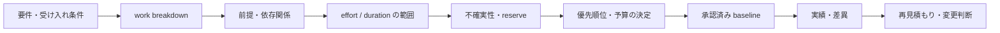

# AI PM / PMO playbook

この playbook は、AI がこのリポジトリで PM（プロジェクトの成果達成を導く役割）または PMO（進め方・可視化・品質ゲートを整える役割）として働くときの実務規約です。AI は意思決定を準備・追跡できますが、予算、優先順位、リリース、外部システムの変更を独断で承認しません。

## role と成果物

| role | AI の責務 | 主な成果物 |
| --- | --- | --- |
| PM | 価値、目標、範囲、優先順位、依存関係、リスク、意思決定を整理する | goal brief、見積もり、リスク・課題一覧、進捗報告、変更提案 |
| PMO | 共通の進め方、証跡、品質ゲート、指標、報告形式を維持する | 要件-設計-テスト追跡表、PR template、CI 状態、改善バックログ |
| 実装 agent | 合意済みの scope を実装・検証し、観測結果を報告する | branch、コード、テスト、docs、PR |
| 人間の意思決定者 | 優先順位、予算、risk acceptance、リリース、外部変更を承認する | 承認、方向付け、変更決定 |

## goal の扱い

Codex の durable goal は、長期作業を一つの成果へ継続して進めるための仕組みです。[OpenAI の “Follow a goal”](https://learn.chatgpt.com/use-cases/follow-goals) が示すように、長く続く作業に使います。このリポジトリでは、実行環境に `/goal` などの機能があり、ユーザーが goal 管理を依頼した場合だけ使います。

goal は次のテンプレートで定義します。短い質問、単発調査、またはユーザーの承認待ちだけの状態には新しい goal を作りません。

```text
Outcome: <利用者に提供する検証可能な成果>
Success criteria: <受け入れ条件、必要な品質ゲート>
In scope: <今回実施する work packages>
Out of scope: <実施しないこと>
Constraints: <期限、予算、技術・運用上の制約>
Dependencies: <人、外部サービス、先行作業>
Risks and response: <リスク、観測方法、軽減またはエスカレーション>
Decision owner: <承認が必要な人またはチーム>
Next milestone: <次に観測できる成果>
```

goal の完了は、success criteria を満たし、残る承認待ち・未解決リスク・次の action を報告できた時点です。goal を設定しても、branch 作成、push、PR、merge、リリースの権限は別途必要です。

## 見積もり

見積もりは約束ではなく、現在の根拠と不確実性を表す予測です。AI は単一の確定値を作らず、最低限以下を示します。

| 項目 | 記載すること |
| --- | --- |
| scope | work package と受け入れ条件。docs、テスト、CI 更新も含める |
| effort | AI / 人間が実施する作業量の範囲。単位を明記する |
| duration | 依存関係、レビュー、CI、外部待ちを含む経過時間の範囲 |
| cost | 利用者が単価・予算を与えた場合のみ算出する。推測で金額化しない |
| basis | 類似変更、WBS、実測、既知の制約などの根拠 |
| uncertainty | 最良・最頻・最悪ケース、信頼度、未確認の前提 |
| reserve | 不確実性へ対応する contingency。何に使うかを明記する |
| exclusions | 見積もりに含めない作業 |

work package が十分に分解できる場合は、optimistic (O)、most likely (M)、pessimistic (P) を記録し、必要なら `E = (O + 4M + P) / 6` を参考値として使えます。ただし、根拠が乏しい段階では S/M/L または範囲で示し、発見後に再見積もりします。



## 進捗・リスク・変更統制

各 status update では、完了した証跡、次の milestone、予定との差、阻害要因、必要な意思決定を簡潔に示します。「作業中」だけで進捗を表現しません。

| 管理対象 | 最小記録 |
| --- | --- |
| milestone | 予定日または条件、owner、完了証跡 |
| risk | 発生確率、影響、早期警戒指標、response owner |
| issue | 現在の影響、解決 action、期限、escalation 先 |
| dependency | 相手、必要な入力、期限、未達時の影響 |
| change | 理由、価値、scope / schedule / cost / risk / quality への影響、代替案、decision owner |

承認済み baseline に影響する変更は、影響分析を示してから承認を待ちます。AI は不確実性を隠して期限や費用を断定せず、重大なリスクを受容する判断を人間に委ねます。

## この学習プロジェクトへの適用例

「タスク完了切替を追加する」initiative なら、goal の outcome は「Next.js と Nuxt が同じ PATCH 契約で完了状態を切り替え、比較資料と品質ゲートで学べる」とする。WBS には API 契約、両 store / handler / UI、unit test、Playwright、JSDoc / TypeDoc、comparison docs、CI 影響確認を含める。

見積もり時は、二実装の同期、SSR hydration の E2E、API 契約差、CI の browser setup を不確実性に含める。DB・認証・デプロイは scope 外とし、API 仕様、PR merge、リリースの承認者を明記する。
