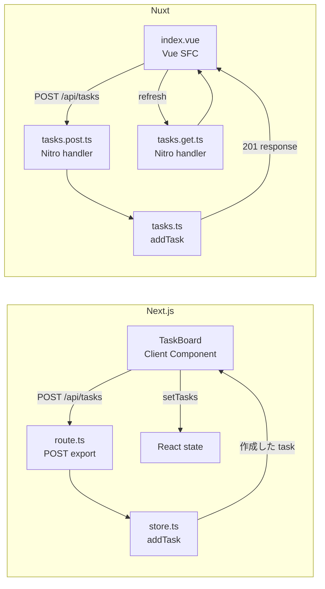
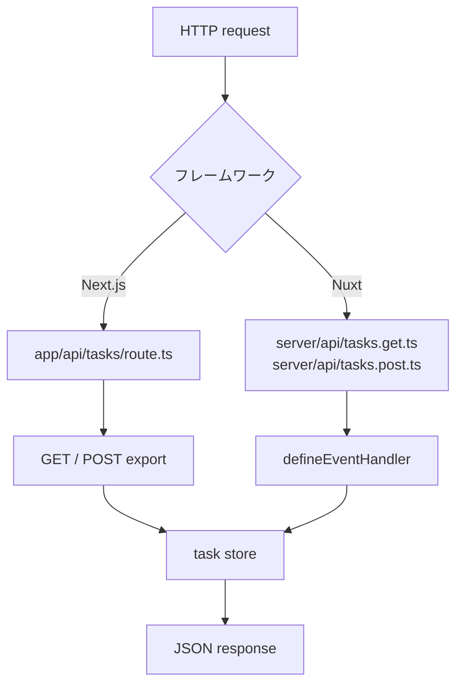

# Next.js と Nuxt の比較ガイド

このリポジトリでは、同じ「タスクを読み取り・追加する」機能を二つのフレームワークで比較します。どちらも TypeScript ですが、React と Vue の考え方がコード構成に現れます。

## 最初に読むファイル

| 観点 | Next.js | Nuxt |
| --- | --- | --- |
| ページ | `next-app/app/page.tsx` | `nuxt-app/app/pages/index.vue` |
| 操作する UI | `next-app/app/task-board.tsx` | `nuxt-app/app/pages/index.vue` |
| GET API | `next-app/app/api/tasks/route.ts` | `nuxt-app/server/api/tasks.get.ts` |
| POST API | 同じ `route.ts` の `POST` export | `nuxt-app/server/api/tasks.post.ts` |
| 状態操作 | `next-app/app/api/tasks/store.ts` | `nuxt-app/server/utils/tasks.ts` |
| テスト | `route.test.ts` | `tasks.test.ts` |

## 画面と状態の考え方

Next.js の `page.tsx` は標準で Server Component です。`useState` や `useEffect`、クリックイベントのようなブラウザ専用の処理は使えないため、`'use client'` を持つ `TaskBoard` に分離しています。JSX の `{remaining}` や `tasks.map(...)` が UI を表現します。

Nuxt の `index.vue` は、template と `<script setup lang="ts">` を一つの Single File Component（SFC）に置きます。`ref` は変更可能な状態、`computed` はそこから計算した状態です。template 側では `{{ remaining }}` と `v-for` で表示します。Nuxt の auto-import により、`ref` や `computed` を明示 import していない点にも注目してください。

## タスク追加の処理フロー

同じ操作でも、画面の状態を更新するタイミングが異なります。Next.js は POST のレスポンスを React state に直接追加し、Nuxt は `refresh()` で API から一覧を再取得します。

## データ取得の違い

Next.js は Client Component がマウントされた後、`useEffect` 内の `fetch('/api/tasks')` で一覧を取得します。追加した task は POST のレスポンスをそのまま `setTasks` へ加えます。

Nuxt はページのトップレベルで `await useFetch('/api/tasks')` を使います。これはサーバー側レンダリング時に取得した結果を Nuxt payload に載せ、ブラウザでの hydration 時に同じリクエストを繰り返さないための仕組みです。追加後は `refresh()` を呼び、一覧を API から再取得します。

## API ルーティングの違い

Next.js App Router は `route.ts` の export 名で HTTP メソッドを決めます。`export function GET` と `export async function POST` が `/api/tasks` を処理します。

Nuxt の Nitro はファイル名で HTTP メソッドを決めます。`tasks.get.ts` は GET、`tasks.post.ts` は POST です。`defineEventHandler` が handler を作り、`readBody` と `createError` は Nuxt/Nitro の auto-import です。

## テストの読み方

`npm run test` は Vitest を実行します。Next.js 側は Route Handler を直接呼び出し、GET、正常な POST、空タイトルの validation を検証します。Nuxt 側は handler から分離した task store をテストし、追加したデータを API 層が読み返せることを検証します。

現在は学習用にメモリ内配列を使っています。実プロダクトでは store の関数をデータベース repository に置き換え、同じテスト境界を維持するのが次のステップです。

## CI と安全性

GitHub Actions は push と pull request で次を実行します。

1. credential pattern scan
2. production dependency の高重要度以上の脆弱性検査
3. TypeScript 型検査
4. Vitest のテスト
5. TypeDoc による API 資料の生成
6. Playwright による両アプリのブラウザテスト
7. Next.js / Nuxt の production build

Dependabot は npm 依存関係と GitHub Actions を週次で監視します。
