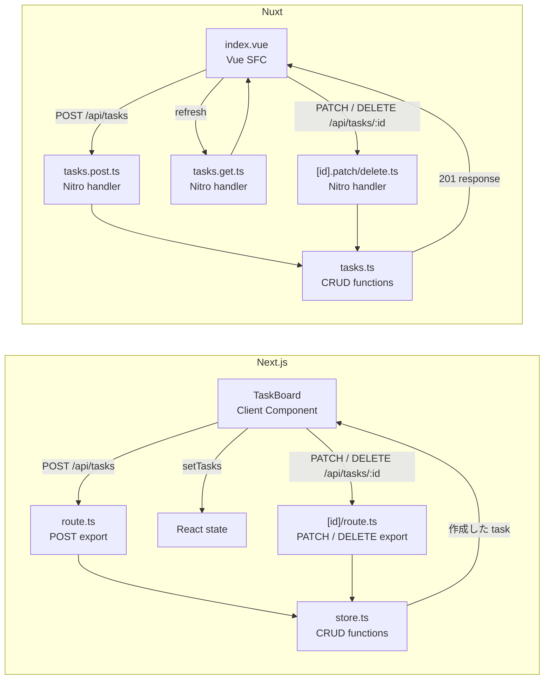
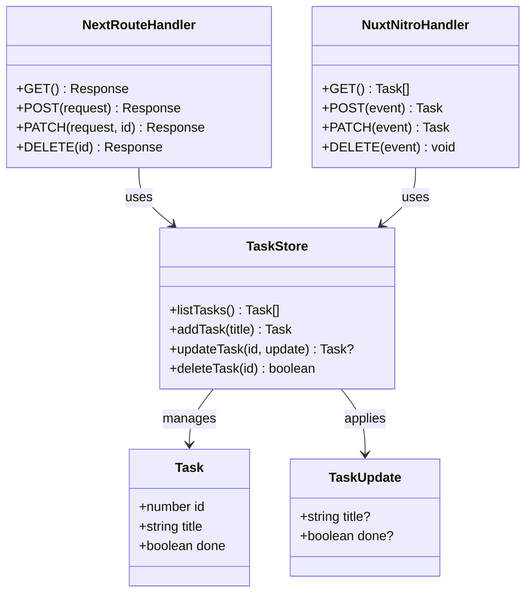
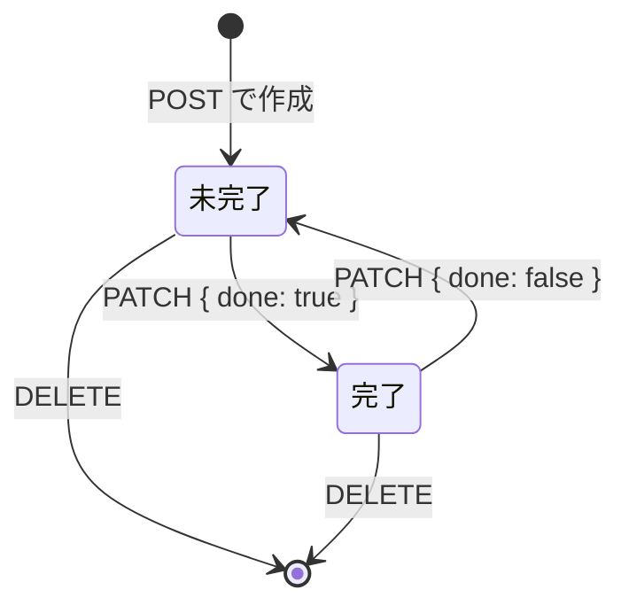
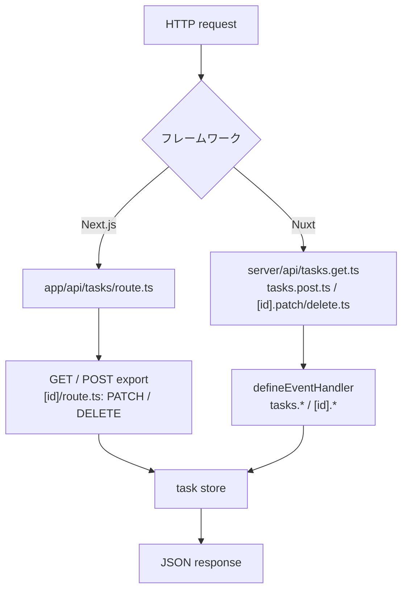

# Next.js と Nuxt の比較ガイド

このリポジトリでは、同じ CRUD（タスクの読み取り・追加・更新・削除）を二つのフレームワークで比較します。どちらも TypeScript ですが、React と Vue の考え方がコード構成に現れます。

## 最初に読むファイル

| 観点 | Next.js | Nuxt |
| --- | --- | --- |
| ページ | `next-app/app/page.tsx` | `nuxt-app/app/pages/index.vue` |
| 操作する UI | `next-app/app/task-board.tsx` | `nuxt-app/app/pages/index.vue` |
| GET API | `next-app/app/api/tasks/route.ts` | `nuxt-app/server/api/tasks.get.ts` |
| POST API | 同じ `route.ts` の `POST` export | `nuxt-app/server/api/tasks.post.ts` |
| PATCH / DELETE API | `next-app/app/api/tasks/[id]/route.ts` | `nuxt-app/server/api/tasks/[id].patch.ts` / `[id].delete.ts` |
| 状態操作 | `next-app/app/api/tasks/store.ts` | `nuxt-app/server/utils/tasks.ts` |
| テスト | `route.test.ts` | `tasks.test.ts` |

## 画面と状態の考え方

Next.js の `page.tsx` は標準で Server Component です。`useState` や `useEffect`、クリックイベントのようなブラウザ専用の処理は使えないため、`'use client'` を持つ `TaskBoard` に分離しています。JSX の `{remaining}` や `tasks.map(...)` が UI を表現します。

Nuxt の `index.vue` は、template と `<script setup lang="ts">` を一つの Single File Component（SFC）に置きます。`ref` は変更可能な状態、`computed` はそこから計算した状態です。template 側では `{{ remaining }}` と `v-for` で表示します。Nuxt の auto-import により、`ref` や `computed` を明示 import していない点にも注目してください。

## タスク変更の処理フロー

同じ CRUD 操作でも、画面の状態を更新するタイミングが異なります。Next.js は POST / PATCH のレスポンスを React state に直接反映し、DELETE は state から除去します。Nuxt は変更後に `refresh()` で API から一覧を再取得します。

## UML で見る責務とデータ

フローチャートは「どこへ進むか」を表すのに対し、UML はデータと責務の関係を表すのに向いています。次のクラス図では、HTTP の処理を受け持つ handler と、メモリ内のデータ操作を受け持つ store を分けています。二つのフレームワークでファイルの置き方は異なりますが、`Task` と CRUD 操作の責務は対応しています。

対応する実装は Next.js では `app/api/tasks/route.ts` と `app/api/tasks/[id]/route.ts`、Nuxt では `server/api/tasks.*.ts` と `server/api/tasks/[id].*.ts` です。store は各アプリの `store.ts` / `tasks.ts` にあり、HTTP 固有の型を持ち込みません。

## UML で見るタスクの状態

`done` は UI 上の「完了にする」「未完了に戻す」を表す状態です。PATCH は title だけ、done だけ、または両方を部分更新できます。削除は状態を変更するのではなく、store から task を取り除く操作です。

## データ取得の違い

Next.js は Client Component がマウントされた後、`useEffect` 内の `fetch('/api/tasks')` で一覧を取得します。追加した task は POST のレスポンスをそのまま `setTasks` へ加えます。

Nuxt はページのトップレベルで `await useFetch('/api/tasks')` を使います。これはサーバー側レンダリング時に取得した結果を Nuxt payload に載せ、ブラウザでの hydration 時に同じリクエストを繰り返さないための仕組みです。追加後は `refresh()` を呼び、一覧を API から再取得します。

## API ルーティングの違い

Next.js App Router は `route.ts` の export 名で HTTP メソッドを決めます。`export function GET` と `export async function POST` が `/api/tasks` を、`app/api/tasks/[id]/route.ts` の `PATCH` / `DELETE` が `/api/tasks/:id` を処理します。

Nuxt の Nitro はファイル名で HTTP メソッドを決めます。`tasks.get.ts` は GET、`tasks.post.ts` は POST、`[id].patch.ts` と `[id].delete.ts` は `/api/tasks/:id` の PATCH / DELETE です。`defineEventHandler` が handler を作り、`readBody` と `createError` は Nuxt/Nitro の auto-import です。

## テストの読み方

`npm run test` は Vitest を実行します。Next.js 側は Route Handler を直接呼び出し、GET、POST、PATCH、DELETE、validation、404 を検証します。Nuxt 側は handler から分離した task store をテストし、追加・更新・削除のデータ操作を検証します。Playwright は両画面で作成、完了状態の更新、削除を通して確認します。

現在は学習用にメモリ内配列を使っています。実プロダクトでは store の関数をデータベース repository に置き換え、同じテスト境界を維持するのが次のステップです。

## CI と安全性

GitHub Actions は push と pull request で次を実行します。

1. credential pattern scan
2. production dependency の高重要度以上の脆弱性検査
3. TypeScript 型検査
4. Vitest のテスト
5. TypeDoc による API 資料の生成
6. Playwright による両アプリのブラウザテスト
7. Next.js / Nuxt の production build

Dependabot は npm 依存関係と GitHub Actions を週次で監視します。
