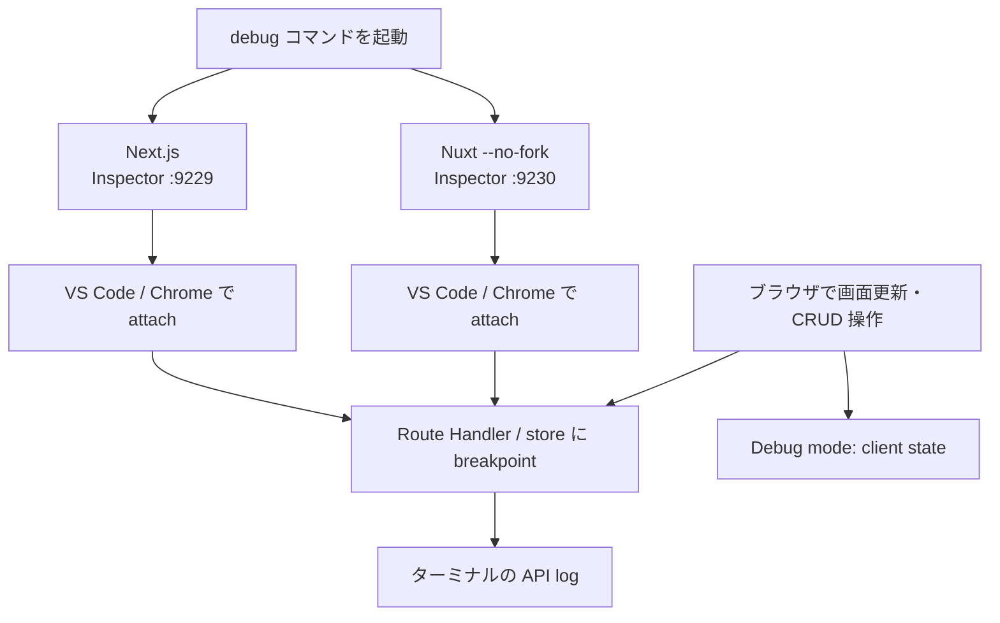
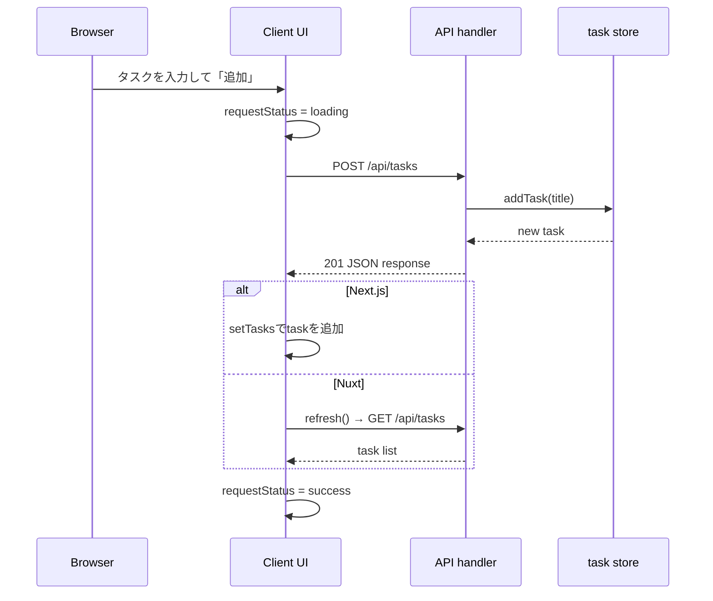

# Next.js / Nuxt デバッグ学習ガイド

このサンプルには、ブラウザで状態を見るモードと Node.js Inspector で server-side breakpoint を止めるモードがあります。Next.js と Nuxt を同時に起動して比較できます。

## 起動

```bash
DEBUG_SAMPLE=true NEXT_PUBLIC_DEBUG_MODE=true npm run dev:next:debug
NUXT_PUBLIC_DEBUG_MODE=true npm run dev:nuxt:debug
```

前者は Inspector port `9229`、後者は `9230` を開きます。Chrome の `chrome://inspect` から対象プロセスを選ぶか、VS Code の「Attach to Node Process」でその port へ attach してください。

VS Code を使う場合は、このリポジトリの `.vscode/launch.json` にある `Attach: Next.js server (9229)` または `Attach: Nuxt server (9230)` を選ぶだけで attach できます。

## デバッグ時の全体像



## 画面で観察する

環境変数を有効にすると、タスク一覧の下に `Debug mode: client state` が表示されます。次を順に観察してください。

1. 初期表示後の `requestStatus` と `tasks`
2. タスクの追加・完了切替・削除中の `loading`
3. 操作成功後の `success` と task 配列の変化

Next.js は `NEXT_PUBLIC_DEBUG_MODE=true`、Nuxt は `NUXT_PUBLIC_DEBUG_MODE=true` を使います。`PUBLIC` が付く値はブラウザへ公開されるため、パスワードや API key を入れてはいけません。

## Breakpoint のおすすめ位置

| 学ぶこと | Next.js | Nuxt |
| --- | --- | --- |
| ブラウザからの取得 | `next-app/app/task-board.tsx` の `fetch` | `nuxt-app/app/pages/index.vue` の `$fetch` |
| GET API | `next-app/app/api/tasks/route.ts` の `GET` | `nuxt-app/server/api/tasks.get.ts` |
| POST API | 同じ `route.ts` の `POST` | `nuxt-app/server/api/tasks.post.ts` |
| PATCH / DELETE API | `next-app/app/api/tasks/[id]/route.ts` | `nuxt-app/server/api/tasks/[id].patch.ts` / `[id].delete.ts` |
| 状態変更 | `next-app/app/api/tasks/store.ts` の `addTask` | `nuxt-app/server/utils/tasks.ts` の `addTask` |

API handler に breakpoint を置いた後、画面を更新、タスクを追加、完了状態を切替、または削除してください。Next.js では HTTP メソッドごとの export に入り、Nuxt ではファイル名に対応する Nitro handler に入ることを確認できます。

## タスク追加をステップ実行する順番



## ログとテスト

Next.js は `DEBUG_SAMPLE=true` で Route Handler の GET/POST ログを出します。Nuxt は public debug mode が有効なときに Nitro handler のログを出します。

デバッガを使う前後で `npm run test` を実行してください。Next.js の Route Handler は 3 件、Nuxt の task store は 2 件のテストで動作を固定しています。ブレークポイントで発見した変更は、まずテストとして再現してから実装すると安全です。
