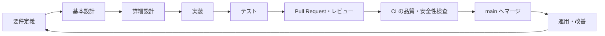
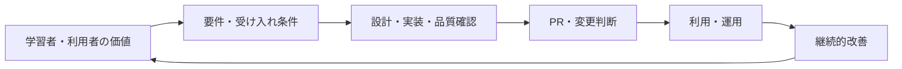
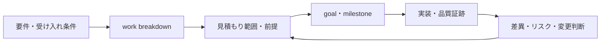
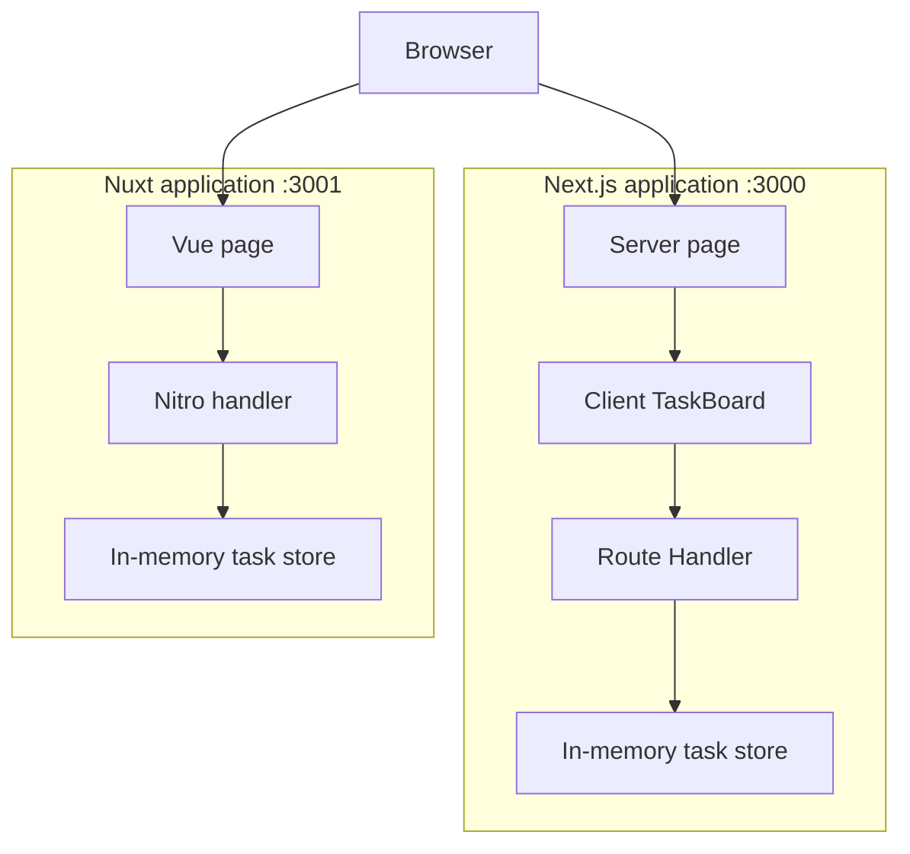
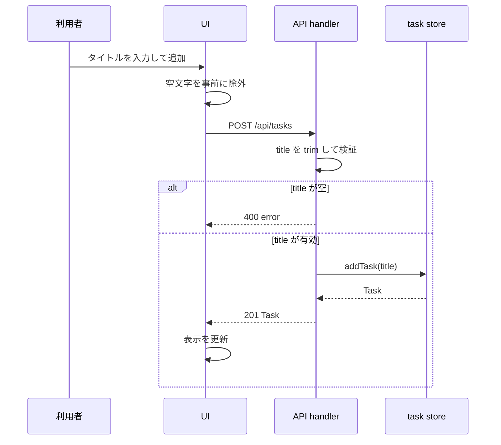
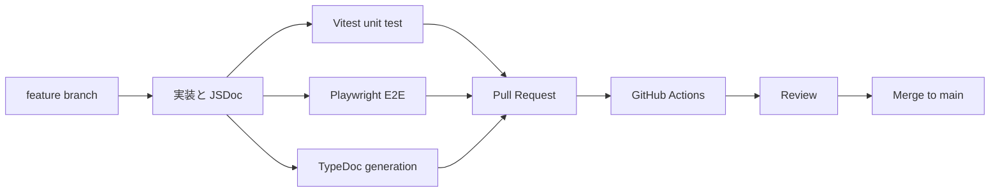

# 学習サンプルを題材にしたプロジェクトフロー

この資料は、このリポジトリを一つの小さなプロダクトと見立てて、要件定義からリリース後の改善までを追うためのガイドです。実案件では規模や組織に応じて成果物の粒度を増やしますが、判断の順序は同じです。

## 全体の流れ

このサンプルでは、要件と設計の判断をコードまで追えるように、Next.js と Nuxt に同じ機能を実装しています。二つを比較すること自体が要件であり、片方だけに存在する機能を不用意に増やさないことも設計上の制約です。

## PMBOK / ITIL の観点

このガイドは、PMBOK の価値提供・原則・パフォーマンスドメインと、ITIL のサービス価値・ガバナンス・継続的改善の考え方を、学習用に軽量化して使います。認定や公式な準拠を目的とするものではありません。詳細な AI 向け対応付けは [PMBOK / ITIL の実践ガイド](../.agents/skills/next-nuxt-learning-sample/references/governance-and-service-management.md) を参照してください。

| プロジェクトの場面 | PMBOK の観点 | ITIL の観点 | このサンプルで行うこと |
| --- | --- | --- | --- |
| 要件定義 | 利用者価値、関係者、範囲 | 価値共創、ガバナンス | 目的、受け入れ条件、対象外を定義する |
| 設計・実装 | 品質、リスク、開発アプローチ | 情報・技術、価値流れ | Next/Nuxt の契約をそろえ、差分を資料化する |
| PR・リリース | 測定、意思決定、不確実性 | 変更管理、保証 | テスト・CI・レビュー結果をマージ判断に使う |
| 運用・改善 | 成果・価値の測定 | 継続的改善 | 問い合わせ、障害、脆弱性を次の要件に戻す |

## 1. 要件定義

まず「誰の、どの課題を、どの範囲で解決するか」を合意します。技術やファイル構成を先に決める段階ではありません。

### 背景・目的

| 項目 | 内容 |
| --- | --- |
| 利用者 | Next.js と Nuxt を学び始める TypeScript 開発者 |
| 課題 | 同じ機能を二つのフレームワークでどう書き分けるか比較しづらい |
| 目的 | 画面、状態、API、テスト、デバッグの対応を実行可能なコードで理解する |
| 成功条件 | 両アプリを同時に起動でき、同じ操作結果を確認できる |

### 機能要件

| ID | 要件 | 受け入れ条件 |
| --- | --- | --- |
| FR-01 | タスク一覧を表示する | 初期タスクが画面に表示される |
| FR-02 | タスクを追加する | 空でないタイトルを入力して追加すると一覧に現れる |
| FR-03 | API を比較できる | Next.js と Nuxt の GET / POST の実装箇所が資料から辿れる |
| FR-04 | デバッグを学べる | Inspector と画面の debug mode を有効化できる |
| FR-05 | API の型と責務を参照できる | `npm run docs:api` で TypeDoc を生成できる |

### 非機能要件・制約

| ID | 要件 | このリポジトリでの方針 |
| --- | --- | --- |
| NFR-01 | 型安全性 | TypeScript と `npm run typecheck` を使う |
| NFR-02 | 再現可能な品質確認 | Vitest、Playwright、production build を CI で実行する |
| NFR-03 | 安全性 | credential pattern scan と production dependency audit を実行する |
| NFR-04 | 開発体験 | `npm run dev` で二つのアプリを同時に起動する |
| CON-01 | 学習の焦点 | 永続 DB、認証、マルチユーザー機能は扱わず、メモリ内 store を使う |

要件の曖昧さを減らすには、「タスクを追加できる」のような文を、観察できる受け入れ条件に変換します。例えば FR-02 は Playwright の E2E テストとして自動化できます。

### 見積もりと goal

見積もりは、工数（effort）、経過時間（duration）、費用（cost）を混同しない予測です。費用は単価や予算が与えられたときだけ算出し、AI が推測で金額を作ることはしません。要件を work package に分解し、前提、依存関係、最良・最頻・最悪ケース、除外範囲、リスク対応を添えて範囲で示します。

長期の initiative では、AI の durable goal（実行環境によっては `/goal`）を使い、Outcome、成功条件、scope / scope 外、制約、依存関係、リスク、承認者、次の milestone を一つの検証可能な目標として追跡します。goal は push、PR、merge、リリースの承認を自動的に与えるものではありません。詳しい PM / PMO の運用は [AI PM / PMO playbook](../.agents/skills/next-nuxt-learning-sample/references/project-management-playbook.md) を参照してください。

## 2. 基本設計（外部設計）

基本設計では、要件を満たす責務の分け方、画面/API の境界、利用者から見える振る舞いを決めます。この時点では関数内部の細かな処理順より、全体構成を明確にします。

### アーキテクチャ

### 外部インターフェース

二つの実装は、同じ HTTP 契約を持ちます。ここを先に決めると、フレームワーク固有の API 実装を比較しやすくなります。

| 操作 | HTTP | パス | 入力 | 成功時 | 失敗時 |
| --- | --- | --- | --- | --- | --- |
| 一覧取得 | GET | `/api/tasks` | なし | `200` と `Task[]` | - |
| タスク追加 | POST | `/api/tasks` | `{ "title": string }` | `201` と `Task` | 空文字なら `400` |

`Task` は `id`、`title`、`done` を持ちます。実案件なら OpenAPI などの API 契約書も同じ段階で管理し、フロントエンドとバックエンドの合意点にします。

## 3. 詳細設計（内部設計）

詳細設計では、各ファイル・関数がどの責務を持ち、どの順番でデータを扱うかを決めます。実装担当者が迷わずコードに落とせ、テスト対象も選べる粒度が目安です。

### 実装への対応

| 責務 | Next.js | Nuxt | 設計上の意図 |
| --- | --- | --- | --- |
| 画面の土台 | `app/page.tsx` | `app/pages/index.vue` | 初期表示と画面構造 |
| 操作と状態 | `app/task-board.tsx` | `app/pages/index.vue` | 入力、一覧、通信状態を管理 |
| GET API | `app/api/tasks/route.ts` の `GET` | `server/api/tasks.get.ts` | HTTP の読み取りを受ける |
| POST API | 同 `POST` | `server/api/tasks.post.ts` | 入力を検証して作成する |
| ドメイン状態 | `app/api/tasks/store.ts` | `server/utils/tasks.ts` | HTTP/UI から独立した task 操作 |

### POST の処理順

### 設計レビューの観点

- 画面コンポーネントが HTTP の細部やデータ保存方法に依存しすぎていないか。
- API handler が入力検証と HTTP 応答を担当し、状態操作は store に分離されているか。
- Next.js と Nuxt で機能・API 契約が揃っており、比較の前提を崩していないか。
- export された型・関数の責務が JSDoc に書かれ、TypeDoc で読めるか。

## 4. 実装・テスト・レビュー

機能ごとに短い作業ブランチを切り、Pull Request で変更目的と検証結果を共有します。`main` への直接 push は避けます。

| 段階 | コマンド | 確認すること |
| --- | --- | --- |
| 型検査 | `npm run typecheck` | TypeScript の型エラーがない |
| 単体テスト | `npm run test` | store と Route Handler の仕様を固定できる |
| ブラウザテスト | `npm run test:e2e` | 利用者操作で両アプリの追加フローが動く |
| API 資料 | `npm run docs:api` | JSDoc から API リファレンスを生成できる |
| ビルド | `npm run build` | production build が通る |

CI は上記に加えて credential scan と production dependency の脆弱性検査を実行します。ローカルで通っても、最終的なマージ判断は PR 上の CI 結果とレビューで行います。

## 5. リリースと運用・改善

この学習用サンプルには本番デプロイを設定していませんが、一般的なプロジェクトなら `main` の品質確認後にステージング、本番の順でリリースします。運用では、障害ログ、利用状況、脆弱性情報、利用者からのフィードバックを次の要件へ戻します。

改善の練習として、次の順で変更してみてください。

1. `done` を切り替える PATCH API を要件・受け入れ条件から追加する。
2. HTTP 契約と画面遷移を基本設計に追記する。
3. Next.js と Nuxt それぞれの詳細設計・JSDoc を更新する。
4. Vitest と Playwright に失敗しうるケースを先に追加する。
5. PR を作り、CI が通ることを確認してからレビュー・マージする。

この反復により、ドキュメント、実装、テストを別々の成果物ではなく、同じ要件を支える一組として学べます。
