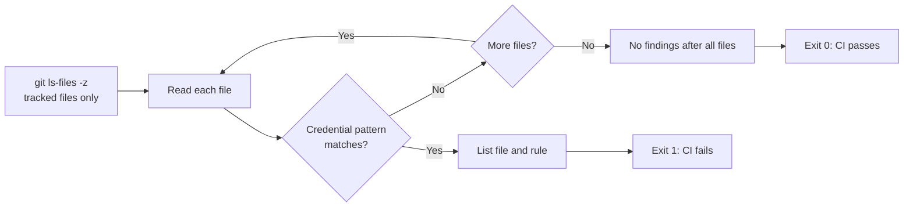

# 安全性チェックの学習ガイド

このリポジトリの credential pattern scan は、ソースへ資格情報を誤ってコミットする前に気付きやすくするための軽量な品質ゲートです。GitHub Actions では、依存関係の脆弱性検査とは別に実行します。前者はリポジトリの内容、後者は production dependency の既知の脆弱性を対象にするため、役割が異なります。

## `check-no-credentials.mjs` は何をするか

[`scripts/check-no-credentials.mjs`](../scripts/check-no-credentials.mjs) は `git ls-files -z` で取得した **Git 管理対象ファイルだけ**を読み、次のような代表的な形式を正規表現で検出します。

| 検出対象 | 例として検出する形式 |
| --- | --- |
| GitHub personal access token | `gh` で始まる token 形式 |
| AWS access key ID | `AKIA` で始まる access key ID 形式 |
| private key | PEM / OpenSSH private key header |
| generic secret assignment | `api_key`、`secret`、`password`、`token` への長い文字列の代入 |

一致が一つでもあれば、ファイル名と検出ルール名を出力して exit code `1` で終了します。GitHub Actions の `Check committed credentials` step はこの終了コードを受け取り、PR を失敗として表示します。一致がなければ対象ファイル数を出力して成功します。



## 実行方法と CI での位置付け

ローカルでは、リポジトリの root で次を実行します。

```bash
node scripts/check-no-credentials.mjs
```

`.github/workflows/ci.yml` でも同じコマンドを実行します。`package.json` script に隠さず Node の実行コマンドを明示しているため、CI 設定、PR の検証記録、ローカル手順を同じ一行で照合できます。

## なぜ `.mjs` を使うか

`.mjs` は Node.js に「このファイルは ECMAScript Module（ESM）である」と明示する拡張子です。このリポジトリの root `package.json` は `"type": "module"` を設定していないため、`.js` では CommonJS として解釈されます。一方、このスクリプトは `import { execFileSync } from 'node:child_process'` のような ESM の static import を使っています。

`.mjs` を選ぶことで package 全体の module 方式を変更せず、次を満たします。

- Node 標準の `node:` module を static import で明確に利用できる。
- `node scripts/check-no-credentials.mjs` だけで、ローカルと GitHub Actions の両方で同じ解釈になる。
- Next.js / Nuxt の TypeScript 設定や npm workspace の module 解釈へ影響しない。

## 対象外と実際の対応

この scan は secret 管理製品やレビューの代替ではありません。未追跡ファイル、Git 履歴、暗号化・エンコード済みの値、高エントロピーの任意文字列、登録されていないサービス固有の形式は検出できない場合があります。また、サンプル値がたまたまパターンに一致すると false positive になる可能性もあります。

実在する credential を検出した、または公開してしまった可能性がある場合は、単に文字列を削除するだけでは不十分です。

1. その credential を直ちに無効化またはローテーションする。
2. 影響範囲とアクセスログを確認し、必要なら incident として記録する。
3. secret は環境変数、CI の secret store、または専用の secret manager に移す。
4. 再発防止として検出ルール、レビュー観点、利用手順を見直す。

この学習サンプルでは、ブラウザへ公開される `NEXT_PUBLIC_*` と `NUXT_PUBLIC_*` に secret を置かないことも守ります。これらは credential scan を通っていても、値がクライアントへ配信されるためです。
