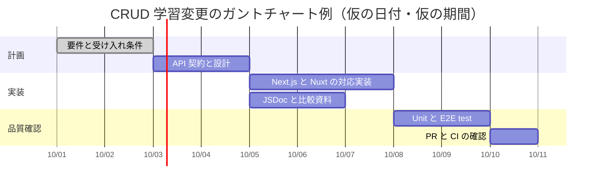
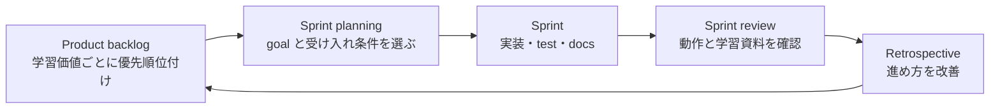
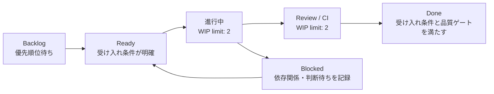

# タスク管理と計画の学習ガイド

この資料では、この学習プロジェクトを題材に、ガントチャート、Scrum、Kanban をどう使い分けるかを説明します。三つは排他的な選択肢ではありません。例えば、リリースまでの大まかな依存関係はガントチャートで可視化し、実装は Scrum の sprint で進め、日々の作業量は Kanban board で制御できます。

この資料の task、日付、期間、WIP limit はすべて学習用の例です。実際の見積もり、期限、費用、優先順位は、受け入れ条件・依存関係・実績・承認者を確認してから決めます。AI は根拠のない確定日や工数を作成しません。

## 使い分け

| 手法 | 主に答える問い | 向く状況 | 注意点 |
| --- | --- | --- | --- |
| ガントチャート | 何がいつまでに、どの順で必要か | milestone、依存関係、複数チームへの説明 | 棒の長さを確定見積もりと誤解しない |
| Scrum | 次の短い反復で、どの価値を完成させるか | 不確実性があり、短い feedback cycle が有効 | sprint 中の scope 変更と緊急作業を可視化する |
| Kanban | 今どこが滞留し、次に何を流すか | 継続的な保守、問い合わせ、small change | WIP limit を無視して「進行中」を増やさない |

## ガントチャートの例

ガントチャートは work package の順序、依存関係、milestone を示します。次は「Next.js と Nuxt へ同じ CRUD 機能を追加する」という架空の変更を分解した例です。日付と期間は Mermaid の表示方法を学ぶためだけの仮値であり、実際の計画ではありません。

この図では、`API 契約と設計` が実装の前提であり、test は実装後に開始しています。一方、`JSDoc と比較資料` は設計後なら実装と並行できます。実案件では dependency、担当者、最良・最頻・最悪の見通し、risk を別途記録し、計画との差が生じたら更新します。

## Scrum の例

Scrum は、優先順位付けした product backlog から sprint goal を選び、短い反復の終わりに完成した increment と feedback を確認する進め方です。このサンプルなら「Next.js と Nuxt の CRUD 契約を同じように学べる」を sprint goal として扱えます。

### このサンプルでの sprint backlog 例

| item | 完了条件 | 追跡先 |
| --- | --- | --- |
| PATCH / DELETE の API 契約 | Next.js / Nuxt の status、validation、404 が一致する | API test、比較ガイド |
| UI 操作 | 両画面で完了切替と削除ができる | Playwright |
| 学習資料 | framework ごとの差と debug 方法が説明される | docs、Mermaid 図 |
| 品質確認 | 型検査、test、TypeDoc、build、安全性検査が通る | CI、PR |

Sprint planning では item を「終わらせるために必要な小さな task」へ分解します。日々の進行確認では、完了率だけでなく、blocked な task、test の失敗、review 待ち、依存関係を確認します。Sprint review で利用者価値と受け入れ条件を確認し、retrospective で process を改善します。

## Kanban の例

Kanban は task の流れを可視化し、同時進行数を制限して滞留を減らします。WIP (work in progress) limit は「作業者の人数」ではなく、特定状態に置ける work item の上限です。

### board を運用する規則の例

| 状態 | 入る条件 | 出る条件 | 観察すること |
| --- | --- | --- | --- |
| Backlog | 価値や問題の候補がある | 優先順位と受け入れ条件が明確 | 古い item、重複、価値の不明確さ |
| Ready | scope と完了条件を説明できる | 作業を開始する | dependency、owner、必要な判断 |
| 進行中 | 実装または資料更新を開始した | review / CI に出せる | WIP limit、滞留時間、blocker |
| Review / CI | PR と検証結果がある | review と必須 check が成功する | failing check、review 待ち、rollback 方法 |
| Done | 受け入れ条件と品質ゲートを満たす | - | 利用者 feedback、改善候補 |
| Blocked | 外部 dependency または判断待ち | blocker が解消する | 影響、次の確認日、decision owner |

WIP limit に達したときは、新しい item を開始する前に review、test、blocker の解消を優先します。これにより、着手数ではなく完了までの flow を改善できます。

## 一つの work item に記録すること

どの手法でも、task を単なるタイトルだけにせず、意思決定と完了確認に必要な最小情報を持たせます。

| 項目 | 目的 |
| --- | --- |
| 目的・利用者価値 | なぜ行うかを確認する |
| 受け入れ条件 | Done を観察可能にする |
| scope / scope 外 | 作業を意図せず拡大しない |
| dependency・risk・blocker | 待ちや不確実性を早期に見える化する |
| owner・decision owner | 実施者と承認者を混同しない |
| 見積もりの根拠と範囲 | effort / duration / cost を混同しない |
| 設計・test・PR | 要件から品質証跡まで追跡する |
| rollback と次の改善 | 変更失敗時と運用後の対応を準備する |

AI が PM / PMO として扱う goal、見積もり、risk、change の詳細は [AI PM / PMO playbook](../.agents/skills/next-nuxt-learning-sample/references/project-management-playbook.md) を参照してください。タスク管理の図は、承認・予算・リリースの権限を AI に与えるものではありません。
